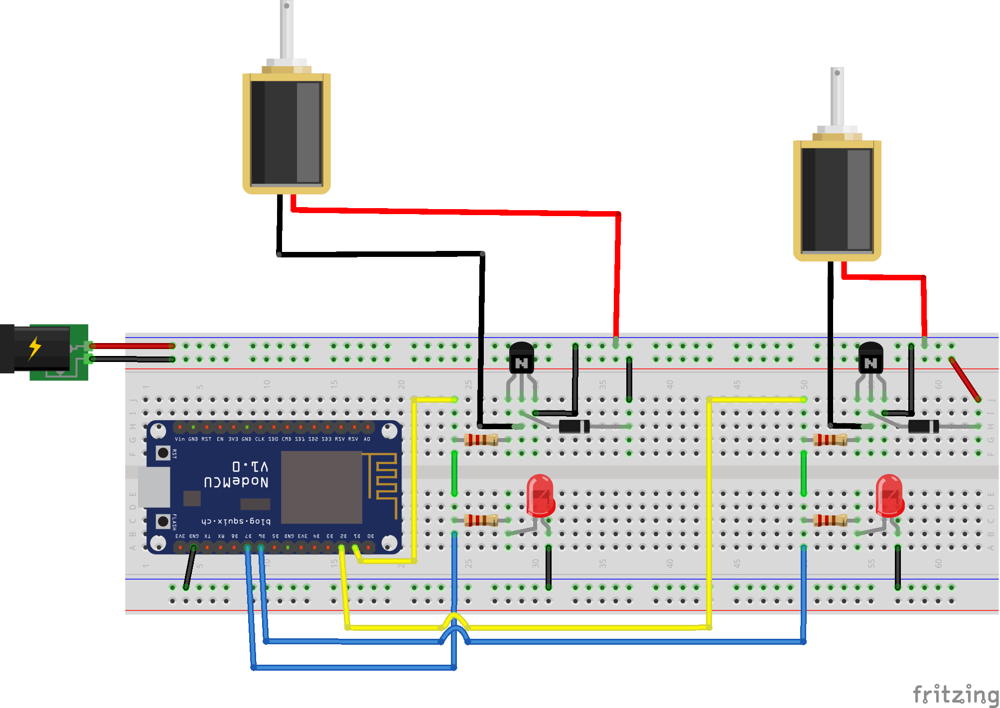

# tkespsol
ESP32/ESP8266 control of solenoids using a tkinter GUI.

Code for switching solenoids wirelessly using an ESP32 or ESP8266 microcontroller controlled using a Python tkinter GUI.  A soft AP configuration is used so a router is not needed. 

Much of the code is taken other sources:
[Setting up the ESP32](https://randomnerdtutorials.com/installing-the-esp32-board-in-arduino-ide-windows-instructions/) and [setting it as a soft AP](https://randomnerdtutorials.com/esp32-access-point-ap-web-server/).

## Requirements
- Microcontrollers -  HUZZAH32 – ESP32 Feather Board from [Adafruit](https://www.adafruit.com/product/3405) or ESP8266 NodeMCU 0.9 (ESP-12 Module), from e.g. [Amazon](https://www.amazon.com/HiLetgo-Internet-Development-Wireless-Micropython/dp/B010O1G1ES). I found the wifi strength and connection reliability to be significantly better with the HUZZAH32.

- MOSFET - FQP30N06L from [sparkfun](https://www.sparkfun.com/products/10213). A MOSFET with a gate voltage that is suitable for the 3.3 V output of the microcontroller.

- The 24 V solenoid valves are from [Lee](https://www.theleeco.com/products/electro-fluidic-systems/solenoid-valves/isolation-valves/lfv-series-solenoid-valves/062-minstac-port-style/) model LFVA2410120H.

 
## Usage

*For the NodeMCU* wire the following circuit:

Solenoid 1  
Output 1: D1  
Input 1:D6  

Solenoid 2  
Output 1: D2  
Input 1:D7  

Upload esp8266_relay.ino code.

*For the HUZZAH32*, it is much the same but the pins are wired :

The HUZZAH32 pins are wired:  
Solenoid 1  
Output 1: 12  
Input 1:33  
  
Solenoid 2  
Output 1: 13  
Input 1:27  

Upload esp32_relay.ino

  
Connect to ESP32_relay or ESP8266_relay wifi network, as appropriate. Run tkinter script. 

When the tkinter button is pressed, the NODEMCU/HUZZAH32 output pin becomes high, the  LED on the solenoid circuit board will light and solenoid will open. The NODEMCU/HUZZAH32 input pin will also become high, be transmitted back to tkinter, and change the color block on the GUI from grey to green, thereby providing feedback on the state of the solenoid. 

A video showing the HUZZAH32 setup in action can be found at [Youtube](https://youtu.be/UIz5XUCvM2Y). More information ation can be found on my [website](https://www.ephys.org/wireless_comm).

## License
The project is distributed under MIT License
