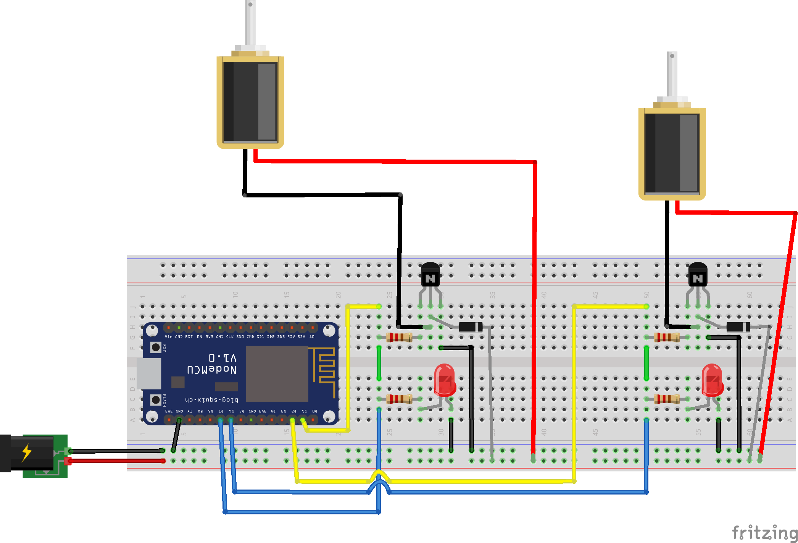

# tkespsol
ESP32/ESP8266 control of solenoids using a tkinter GUI

Code for switching solenoids wirelessly using an ESP32 or ESP8266 microcontroller controlled using a Python tkinter GUI.  A soft AP configuration is used so a router is not needed.

Much of the code is taken other sources:
[Setting up the ESP32](https://randomnerdtutorials.com/installing-the-esp32-board-in-arduino-ide-windows-instructions/) and [setting it as a soft AP](https://randomnerdtutorials.com/esp32-access-point-ap-web-server/).


## Requirements
- Microcontrollers -  HUZZAH32 – ESP32 Feather Board from [Adafruit](https://www.adafruit.com/product/3405) or ESP8266 NodeMCU 0.9 (ESP-12 Module),  

- MOSFET - FQP30N06L from [sparkfun](https://www.sparkfun.com/products/10213). A MOSFET with a gate voltage that is suitable for the 3.3 V output of the microcontroller.

- The 24 V solenoid valves are from Lee https://www.theleeco.com/products/electro-fluidic-systems/solenoid-valves/isolation-valves/lfv-series-solenoid-valves/062-minstac-port-style/ model LFVA2410120H.


## Usage


For the NodeMCU wire the solenoids as follows:
.

The NODEMCU pins are as follows:
Solenoid 1
Output 1: D1
Input 1:D6

Solenoid 2
Output 1: D2
Input 1:D7


Install code and libraries described in the links above.

If the you encounter an error using I2C communication protocol for the BME, try switching the address from  0x76 to  0x77 at `status = bme.begin(0x77)`.

To switch to a Json output, remove
```char msg[200];
sprintf(msg, "%f,%f,%f,%f", temperature,pressure,altitude,humidity);
webSocket.sendTXT(0,msg);
```
and uncomment
```
//Using JSON format

//DynamicJsonDocument  doc(200);

//doc["Temperature"] = tempstr;
//  doc["Pressure"] = presstr;
//
//  doc["Pressure"] = altstr;
//
//  doc["Humidity"] = humstr;

//String output;
//serializeJson(doc, output);
//webSocket.sendTXT(0,output);
```

Works well with the python application [socscrollsave](https://github.com/damianjwilliams/socscrollsave), which allows real-time plotting of sensor data and saving data as a csv file.
See my [website](https://www.ephys.org/esp32) for examples.

## License
The project is distributed under MIT License
